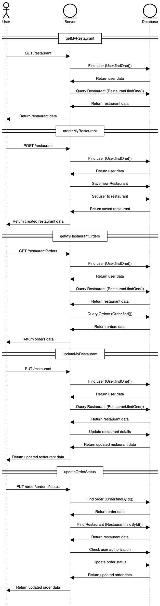

# Food Ordering Application

## Project Title
Food Ordering Application with MongoDB, Tailwindcss, React, and TypeScript

## Project Overview
The food ordering application aims to provide an intuitive and seamless platform for customers to browse through menus and order food. The system will allow users to select food items, customize orders, and make payments. It will integrate with a back-end database (MongoDB) to store orders, and menu data. React, coupled with TypeScript, will be used to develop a responsive and interactive front-end interface.

## Objectives
The main objectives of this project are:
- **Browse Menu & Select Food**: The app will allow users to browse through food categories, filter by the city of the restaurant’s locations, and select items for their orders.
- **Order Management**: Users can add multiple items to their cart, modify their orders, and proceed with checkout.
- **Data Preparation**: Create dummy data to populate the application and verify if the frontend functions properly with real data.

## Technology Stack

### Frontend
- **React**: The user interface will be built using React to offer an interactive and responsive experience.
- **TypeScript**: TypeScript will be used to ensure the application is type-safe, reducing bugs and enhancing code maintainability.
- **TailwindCSS**: For styling the front-end components and ensuring responsiveness across devices.

### Backend
- **MongoDB**: A NoSQL database will be used to store user data, food menus, orders, and payment records.
- **Node.js & Express**: The backend API will be built using Node.js and Express to handle data requests, and interaction with MongoDB.

## GitHub Repository
- **Repository Link**: [GitHub - Food Ordering App](https://github.com/cdrcstcs/CP3407-AdvancedSoftwareEngineer)

## Team Members

- **Student Name 1**: Nguyen Dang Hieu  
  **Project Role(s)**: [Frontend Developer,UI/UX Designer,Backend Developer, Database Administrator]

- **Student Name 2**: Low Yi Heng  
  **Project Role(s)**: [UI/UX Designer]

## Installation

### Prerequisites
Ensure you have the following installed on your machine:
- Node.js
- MongoDB (or access to a cloud MongoDB service)
- Git

### Steps to Run the Application Locally
1. Clone the repository:
   ```bash
   git clone https://github.com/cdrcstcs/CP3407-AdvancedSoftwareEngineer.git


# Food Ordering Application

## Project Title
Food Ordering Application with MongoDB, TailwindCSS, React, and TypeScript

## Activity One: User Interviews and Feedback

### Objective:
The goal of this activity was to gather feedback from potential users regarding their requirements and expectations for the food ordering application. Our team conducted interviews with three user groups:
- **Customers** (end-users who will order food)
- **Restaurant Owners** (who will list their menu items)

### Interview Questions & Responses

1. **What key features do you expect in a food ordering application?**
   - **Response**: "I expect a food ordering application to have a user-friendly interface, allowing easy navigation and smooth browsing. It should include restaurant and menu listings with clear categorization, secure multiple payment options, and real-time order tracking. Additionally, order management features, such as the ability to modify or cancel orders, customer reviews, and loyalty rewards, would enhance the overall experience."

2. **How important is customization of food orders?**
   - **Response**: "Customization of food orders is very important. Users should be able to modify their orders by removing or adding ingredients, selecting portion sizes, and choosing dietary preferences such as gluten-free, vegan, or halal options. This ensures that the app caters to a wide range of customer needs and preferences."

3. **What are your preferred payment methods?**
   - **Response**: "I prefer to have multiple payment options, including credit and debit cards (Visa, Mastercard), digital wallets such as PayPal, Apple Pay, and Google Pay, as well as cash on delivery and QR code payments. Having a variety of secure payment methods makes the ordering process more convenient and accessible."

4. **Would you like real-time order tracking?**
   - **Response**: "Yes, real-time order tracking is essential. It provides transparency by allowing users to track their order status from preparation to delivery. Push notifications at different stages, such as order acceptance, preparation, and out-for-delivery updates, would improve the overall user experience."

5. **What kind of filters would be useful for browsing menus?**
   - **Response**: "Useful filters for browsing menus would include cuisine type (Italian, Chinese, Indian, etc.), dietary preferences (vegetarian, halal, keto, etc.), price range, customer ratings, and estimated delivery time. These filters would help users quickly find the best food options based on their preferences."

6. **How would you like to receive order status updates?**
   - **Response**: "I would prefer to receive order status updates through push notifications for instant alerts. SMS updates would also be useful for those who may not have the app open. Additionally, email confirmations for receipts and records and in-app tracking for live updates would enhance the ordering experience."

## Next Steps:
Based on the feedback from the user interviews, we will incorporate the following features into the Food Ordering Application:
- A user-friendly interface with clear categories and easy navigation
- Customization options for food orders, including dietary preferences
- Multiple secure payment methods
- Real-time order tracking with push notifications and updates
- Filters for menu browsing based on preferences
- Order status updates via push notifications, SMS, and email

These features will help create an app that meets user expectations and enhances the overall user experience.

# User Feedback Summary

## Based on the interviews conducted, we gathered insights from two primary user groups: customers and restaurant owners. Below is a summary of their expectations and requirements.

## 1. Customer Feedback

### Key Features Expected:
- A simple and intuitive interface with easy navigation.
- A well-organized menu with food categories and filters.
- Secure multiple payment options (credit/debit cards, digital wallets, QR codes, cash on delivery).
- Real-time order tracking from preparation to delivery.
- Customer reviews and ratings for food and restaurants.
- Loyalty rewards and promotional discounts to encourage repeat orders.

### Importance of Customization:
High importance; users want options to:
- Modify ingredients (e.g., remove onions, add extra cheese).
- Choose portion sizes.
- Select dietary preferences (vegetarian, halal, gluten-free, keto, etc.).

### Preferred Payment Methods:
- Credit/Debit Cards (Visa, Mastercard).
- Digital Wallets (PayPal, Apple Pay, Google Pay).
- Cash on Delivery.
- QR Code Payments for faster transactions.

### Real-Time Order Tracking:
- Considered a must-have feature by most customers.
- Users want live tracking and push notifications at different order stages (accepted, prepared, out for delivery).

### Useful Filters for Browsing Menus:
- Cuisine type (Italian, Chinese, Indian, etc.).
- Dietary preferences (vegetarian, halal, keto, etc.).
- Price range to match their budget.
- Customer ratings to find the best restaurants.
- Estimated delivery time for faster service.

### Preferred Order Status Updates:
- Push notifications for real-time alerts.
- SMS updates for users who may not have the app open.
- Email confirmations for receipts and records.
- In-app tracking for detailed order status updates.

## 2. Restaurant Owner Feedback

### Key Features Expected:
- Easy menu management (add, edit, remove items with pricing and availability).
- Order management system to track incoming orders in real-time.
- Analytics and reporting to track sales, popular items, and customer preferences.
- Promotion and discount management to attract customers.
- Integration with delivery services for smooth fulfillment.

### Importance of Order Management:
- Critical for efficiency—restaurants need an intuitive dashboard to update order statuses quickly.
- Ability to mark preparing, ready, completed, or canceled for real-time customer updates.

### Preferred Payment Handling:
- Ability to receive direct payments through the platform (commission-based or subscription model).
- Option to set cash-only, card-only, or both payment methods for their restaurant.

### Business Growth Features:
- Insights on customer preferences to optimize menu offerings.
- Sales reports and trends to improve decision-making.
- Loyalty programs to retain repeat customers.

---

# Activity Two: Requirements Document and User Story Estimations

## User Story 1: Browsing and Ordering Food
**As a customer,**
_I want to browse a well-organized food menu, filter the food items by different criteria, and add my selected items to the cart,_
_So that I can easily find my desired food, customize my order, and proceed to checkout efficiently._

### Acceptance Criteria:
#### Menu Browsing:
- The app should display a list of food categories (e.g., starters, main course, desserts, etc.).
- Users should be able to browse food items within each category and view detailed information about each item (e.g., ingredients, portion size, price).

#### Filters:
Users can apply filters to search the menu by:
- Cuisine type (e.g., Italian, Chinese, Indian).
- Dietary preferences (e.g., vegetarian, gluten-free, halal).
- Price range (e.g., $10–$20).
- Location (city or restaurant location).
- Multiple filters can be applied at the same time.

#### Customizing Orders:
After selecting an item, the app should allow users to customize the order:
- Modify ingredients (e.g., remove onions, add extra cheese).
- Choose portion size (e.g., small, medium, large).
- Select dietary preferences (e.g., gluten-free, vegan).

#### Adding to Cart:
- Users can add multiple food items to the cart.
- Users can view the cart contents, modify quantities, or remove items from the cart before proceeding to checkout.

#### Checkout:
- Once satisfied, users can proceed to checkout, entering their delivery address and payment details.
- The app should offer multiple payment options, such as credit card, digital wallets (PayPal, Apple Pay, etc.), and cash on delivery.

## User Story 2: Real-Time Order Tracking for Customers
**As a customer,**
_I want to receive real-time order status updates via notifications,_
_So that I can track my order from preparation to delivery and be informed of any changes or delays._

### Acceptance Criteria:
#### Order Tracking:
- Once an order is placed, the customer should receive an initial notification confirming the order and estimated delivery time.
- Real-time updates should be sent when the order moves through various stages:
  - Order received.
  - Order is being prepared.
  - Order is ready for delivery.
  - Order is out for delivery.
  - Order successfully delivered.

#### Notifications:
- Push notifications should be sent to the customer at each stage, ensuring they are kept informed without opening the app.
- If the app is closed, SMS or email notifications should be sent.

#### Order Details:
- The customer can view detailed order status within the app, showing progress in real-time (e.g., "Preparing," "Out for delivery," etc.).
- Estimated delivery time should be updated as the order moves through each stage.

#### Order Modifications:
- If there are any delays or issues with the order, the app should send notifications with an updated estimated delivery time.
- The customer can request to modify or cancel the order if the restaurant permits it (e.g., via the app).

## User Story 3: Restaurant Order Management
**As a restaurant owner,**
_I want to manage incoming orders, update their status, and track order progress in real-time,_
_So that I can ensure smooth order fulfillment and keep customers informed of their order status._

### Acceptance Criteria:
#### Order Dashboard:
- Restaurant owners should have access to an intuitive dashboard where they can view all incoming orders.
- Each order should display essential details such as customer name, food items, order status, and delivery time.

#### Order Status Updates:
- Restaurant owners should be able to update the status of each order manually or automatically:
  - Order received.
  - Order being prepared.
  - Order ready for delivery.
  - Order completed.
- The app should allow owners to mark orders as canceled or completed if necessary.

#### Notifications for Order Status:
- Once an order status is updated, the customer should receive a notification reflecting the change (e.g., "Your order is being prepared").

#### Order Modification:
- If an order needs to be modified (e.g., due to ingredient unavailability or a customer request), the owner should be able to update the order and inform the customer.

#### Analytics and Reports:
- The app should provide restaurant owners with insights on order trends, popular menu items, customer feedback, and sales performance.
- These analytics should help owners optimize their menu offerings and improve business operations.

## User Story 4: Customer Feedback and Rating System
**As a customer,**  
_I want to rate and provide feedback on my food and delivery experience,_  
_So that I can help improve the service and guide other customers in their decisions._

### Acceptance Criteria:

#### Rating Food and Delivery:
- After receiving the order, the app should prompt the customer to rate their food and delivery experience on a scale (e.g., 1 to 5 stars).
- Customers should be able to leave optional comments to provide more detailed feedback.

#### Review Submission:
- Once the rating is submitted, the customer should receive a confirmation that their feedback has been successfully recorded.
- The app should allow users to edit or delete their reviews within a limited time (e.g., 24 hours) after submission.

#### Displaying Reviews:
- The app should display aggregated ratings (average score) and individual customer reviews for each food item and restaurant.
- Reviews should be visible to other customers when browsing the menu or restaurant.

#### Admin Review Management:
- Restaurant owners should have access to customer feedback through an admin panel and can respond to reviews or address complaints.
- Negative reviews should trigger an alert to the restaurant owner to ensure timely attention.

#### Incentives for Feedback:
- The app should offer occasional rewards or incentives (e.g., discount codes, loyalty points) for customers who leave reviews.

## User Story 5: Loyalty Program and Rewards for Customers
**As a customer,**  
_I want to earn loyalty points and redeem them for discounts or free items,_  
_So that I am incentivized to order more frequently and feel valued as a customer._

### Acceptance Criteria:

#### Earning Points:
- Customers should automatically earn loyalty points for every successful order they make, with a set amount of points per dollar spent (e.g., 1 point per $1 spent).
- Points should be clearly visible in the user's profile and updated after each order.

#### Redeeming Points:
- Customers should be able to redeem accumulated points for rewards, such as discounts on future orders, free items, or exclusive offers.
- A clear redemption process should be presented in the app, showing available rewards based on the customer's points balance.

#### Tiered Loyalty System:
- The app should offer multiple levels of loyalty (e.g., bronze, silver, gold) based on the customer’s total points accumulated over time.
- Higher-tier members should receive additional benefits, such as faster delivery, special promotions, or exclusive access to new menu items.

#### Points Expiry:
- Loyalty points should have an expiration date (e.g., 6 months), and the app should notify customers when their points are nearing expiration.

#### Loyalty Program Notifications:
- The app should send notifications to customers when they earn points, when their points are about to expire, or when they unlock new rewards or tiers.

## Activity Three: User Story Prioritization and Iteration Planning

### 1. Prioritization of User Stories

#### Priority Criteria
- **High Priority**: Features essential for the core functionality of the application, directly impacting user experience and application flow.
- **Medium Priority**: Features that are important for usability but can be added once the core functionality is stable.
- **Low Priority**: Features that are nice to have but not critical for the initial version of the application.

#### User Stories and Their Prioritization

| **User Story**                           | **Priority** | **Reason**                                                                 |
|------------------------------------------|--------------|---------------------------------------------------------------------------|
| Browsing and Ordering Food              | High         | Fundamental for customers; the app cannot function without it.           |
| Real-Time Order Tracking for Customers   | High         | Essential for user satisfaction and transparency.                         |
| Restaurant Order Management              | High         | Necessary for restaurants to manage orders.                              |
| Order Customization and Cart Management | Medium       | Important for user satisfaction, but can be added after basic features.  |
| Payment Integration                      | Medium       | Critical for completing transactions, but can be tested with mock data.  |
| Loyalty Program and Promotions           | Low          | Good for retention, but not necessary for the first iteration.           |
| Advanced Search and Filtering            | Medium       | Useful but can be added after basic browsing features are implemented.   |
| Analytics and Reporting for Restaurants | Low          | Important for restaurant owners, but can be implemented after core features. |

### 2. Dividing User Stories into Iterations

Based on the prioritization, we will break the development of user stories into three iterations. Each iteration will focus on a set of features that build upon each other, ensuring a progressive release of functionalities.

#### **Iteration 1: Core Features for Browsing and Ordering**
**User Stories:**
- Browsing and Ordering Food
- Restaurant Order Management

**Description**:  
In this iteration, we will focus on getting the core functionalities of the application working. Customers will be able to browse menus, select food items, and add them to their cart. Restaurants will be able to view and manage orders in real-time.

**Estimated Time**: 3 weeks

**Tasks:**
- Build the front-end interface for browsing food categories and items.
- Implement the functionality for adding food items to the cart.
- Develop the backend API for order management and ensure real-time updates for restaurant owners.
- Perform basic testing to verify that browsing, ordering, and restaurant management are functional.

---

#### **Iteration 2: User Experience Enhancements and Order Tracking**
**User Stories:**
- Real-Time Order Tracking for Customers
- Order Customization and Cart Management

**Description**:  
In this iteration, we will enhance the user experience by allowing customers to track their orders in real time. We will also add functionality for customizing food orders and managing the cart (e.g., modifying order quantities, removing items).

**Estimated Time**: 2 weeks

**Tasks:**
- Implement the real-time order tracking feature, including notifications for order status.
- Allow users to customize their orders (e.g., remove ingredients, adjust portion size).
- Add features to modify the cart (add/remove items, change quantities).
- Conduct testing and integration to ensure smooth order tracking and customization.

---

#### **Iteration 3: Payment Integration, Analytics, and Additional Features**
**User Stories:**
- Payment Integration
- Advanced Search and Filtering
- Analytics and Reporting for Restaurants
- Loyalty Program and Promotions

**Description**:  
In this final iteration, we will integrate payment options and enhance the app's search capabilities. Restaurant owners will gain access to analytics and reporting features, and a loyalty program will be added to incentivize repeat customers.

**Estimated Time**: 3 weeks

**Tasks:**
- Integrate payment methods (credit/debit card, PayPal, QR code, etc.).
- Develop advanced filtering for searching food items (e.g., price range, dietary preferences).
- Implement an analytics dashboard for restaurant owners to view order data and trends.
- Add basic functionality for a loyalty program and promotional discounts.
- Perform extensive testing to ensure all features work seamlessly.

### 3. Iteration Summary

| **Iteration** | **Features**                                      | **Time Estimate** |
|---------------|---------------------------------------------------|-------------------|
| **Iteration 1** | Core functionalities for browsing, ordering, and order management | 3 weeks          |
| **Iteration 2** | Real-time order tracking, order customization, and cart management | 2 weeks          |
| **Iteration 3** | Payment integration, advanced search, analytics, and loyalty program | 3 weeks          |

### 4. Conclusion

By dividing the user stories into three iterations, we have created a structured plan that allows for the progressive development of the Food Ordering Application. Iteration 1 ensures that core features are functional, providing a foundation for future enhancements in Iteration 2. Finally, Iteration 3 will add advanced features like payment processing, search filters, and loyalty programs, rounding out the application for full deployment.

# Workshop 4
# Activity 1
# Food Ordering Application - User Stories and Estimations

## User Story 1: Browsing and Ordering Food
**As a customer, I want to browse a well-organized food menu, filter the food items by different criteria, and add my selected items to the cart, so that I can easily find my desired food, customize my order, and proceed to checkout efficiently.**

**Estimation: 40 hours**

### Tasks and Estimations:
- **Menu Browsing Interface (12 hours)**
  - Design UI for food categories and items: 4 hours
  - Implement front-end logic for menu browsing: 5 hours
  - Integrate with the back-end to fetch food items: 3 hours

- **Filters (10 hours)**
  - Design UI for filters (e.g., price, dietary restrictions, cuisine): 4 hours
  - Implement back-end logic for filtering food items: 3 hours
  - Test filtering functionality: 3 hours

- **Food Item Details (Customization, Prices) (10 hours)**
  - Design UI for food item details (ingredients, portion sizes, prices): 4 hours
  - Implement front-end logic for customizing food items: 4 hours
  - Integrate back-end API for updating food item customization: 2 hours

- **Cart Functionality and Checkout Process (8 hours)**
  - Implement functionality to add food items to the cart: 3 hours
  - Implement cart view and edit options (modify quantity, remove items): 3 hours
  - Design checkout page UI and integrate with back-end for order submission: 2 hours

---

## User Story 2: Real-Time Order Tracking for Customers
**As a customer, I want to receive real-time order status updates via notifications, so that I can track my order from preparation to delivery and be informed of any changes or delays.**

**Estimation: 30 hours**

### Tasks and Estimations:
- **Real-time Updates (15 hours)**
  - Design UI for displaying order status updates (preparing, ready, completed): 5 hours
  - Implement real-time order status updates (e.g., using WebSockets or polling): 6 hours
  - Test real-time updates across different devices: 4 hours

- **Push Notifications Integration (10 hours)**
  - Set up push notification service (Firebase/OneSignal): 4 hours
  - Implement push notifications for order status updates: 4 hours
  - Test notifications for different scenarios (order status changes, delays, etc.): 2 hours

- **SMS/Email Fallback (5 hours)**
  - Integrate SMS/Email notification service (Twilio, SendGrid): 3 hours
  - Implement logic for fallback SMS/Email notifications: 2 hours

---

## User Story 3: Restaurant Order Management
**As a restaurant owner, I want to manage incoming orders, update their status, and track order progress in real-time, so that I can ensure smooth order fulfillment and keep customers informed of their order status.**

**Estimation: 50 hours**

### Tasks and Estimations:
- **Order Dashboard (20 hours)**
  - Design UI for order management dashboard (incoming orders, current status): 8 hours
  - Implement backend API for fetching and displaying incoming orders: 6 hours
  - Implement front-end logic to display orders in real-time: 6 hours

- **Order Status Updates (Preparing, Ready, Completed) (15 hours)**
  - Design UI to update order statuses: 5 hours
  - Implement backend functionality to update order statuses (preparing, ready, completed): 6 hours
  - Integrate the order status with the real-time system: 4 hours

- **Menu Management (Edit/Add/Remove Items) (10 hours)**
  - Design UI for adding/editing/removing menu items: 4 hours
  - Implement backend logic to update menu items (CRUD operations): 5 hours
  - Test the menu management system: 1 hour

- **Analytics Integration (5 hours)**
  - Design UI for basic order analytics (total orders, revenue): 2 hours
  - Implement backend logic to fetch order data and generate reports: 2 hours
  - Integrate analytics data with the front-end: 1 hour

---

## Iteration Breakdown

### Iteration 1: Core Features for Browsing and Ordering (3 weeks)
- **Browsing and Ordering Food**
  - Tasks: Menu Browsing Interface (12 hours), Filters (10 hours), Food Item Details (Customization, Prices) (10 hours), Cart Functionality and Checkout Process (8 hours)
  - **Total time**: 40 hours

- **Restaurant Order Management**
  - Tasks: Order Dashboard (20 hours), Order Status Updates (15 hours)
  - **Total time**: 35 hours

---

### Iteration 2: User Experience Enhancements and Order Tracking (2 weeks)
- **Real-Time Order Tracking for Customers**
  - Tasks: Real-time Updates (15 hours), Push Notifications Integration (10 hours), SMS/Email Fallback (5 hours)
  - **Total time**: 30 hours

- **Order Customization and Cart Management**
  - Tasks: UI for Customization (5 hours), Backend for Customization (5 hours), Cart Management (5 hours)
  - **Total time**: 15 hours

---

### Iteration 3: Payment Integration, Analytics, and Additional Features (3 weeks)
- **Payment Integration**
  - Tasks: Integrate Payment Methods (15 hours)

- **Advanced Search and Filtering**
  - Tasks: Search Filters UI (5 hours), Backend for Advanced Filters (5 hours)

- **Analytics and Reporting for Restaurants**
  - Tasks: Analytics Dashboard UI (5 hours), Backend Analytics Integration (5 hours)

- **Loyalty Program and Promotions**
  - Tasks: Loyalty Program Logic (5 hours), Promo Code System (5 hours)

---

## Summary of Time Estimates by Iteration:
- **Iteration 1:**
  - **Total time**: 75 hours (3 weeks)

- **Iteration 2:**
  - **Total time**: 45 hours (2 weeks)

- **Iteration 3:**
  - **Total time**: 50 hours (3 weeks)

# Class Diagram


# Sequence Diagram


# Workshop 5

## Single Responsibility Principle (SRP)

The Single Responsibility Principle (SRP) states that a class or module should have only one reason to change, meaning it should have only one responsibility or concern. Below is an evaluation of different schemas based on SRP.

### 1. Image Schema
**Responsibility:**  
The Image schema represents an image object with a filename and is tied to storing image-related data.

**Evaluation:**  
This class adheres to SRP well. It has a single responsibility: handling image data (storing the image file name). There's no deviation from the single responsibility.

---

### 2. Order Schema
**Responsibility:**  
The Order schema is responsible for capturing information related to customer orders. This includes restaurant info, user details, delivery details, cart items, order status, etc.

**Evaluation:**  
The Order schema generally follows SRP, but it might be argued that its responsibility is quite broad. It ties together several concerns such as user, restaurant, cart items, delivery details, and order status. For better clarity and separation of concerns, it might make sense to break parts of the schema into smaller sub-documents. For example:
- Separating `deliveryDetails` or `cartItems` into their own models could make the schema more modular.

As it stands, the Order schema is focused primarily on order data.

---

### 3. MenuItem Schema
**Responsibility:**  
The MenuItem schema represents a menu item with a name and price.

**Evaluation:**  
This schema is focused and adheres to SRP. It is dedicated to defining a single unit in a restaurant's menu.

---

### 4. Restaurant Schema
**Responsibility:**  
The Restaurant schema represents restaurant data, including user ownership, restaurant details, menu items, image references, etc.

**Evaluation:**  
This schema is performing multiple responsibilities, including managing restaurant info (name, location), menu items, and linking to image and user data. While this generally follows SRP, there’s potential to split responsibilities:
- `MenuItems` could be separated into their own model for better flexibility.
- References to `Image` and `User` could be abstracted into their respective models. However, including these references here is acceptable as they are intrinsic to the restaurant's setup.

---

### 5. User Schema
**Responsibility:**  
The User schema represents user data, including personal details, authentication info, and references to images and hotels.

**Evaluation:**  
This schema is somewhat broad in scope. It defines both a user’s personal details and references to images and hotels. It could be argued that it should focus primarily on user data such as authentication info (email, password), while image and hotel references could be placed in separate models. However, for this context, the inclusion of these references is acceptable, as they represent a one-to-one relationship between user and image/hotel.

---

## Don't Repeat Yourself (DRY)

The DRY principle suggests that duplication in code or data structures should be avoided. Below are observations and recommendations for reducing redundancy across models.

### 1. Repeated References to Image in Multiple Models
**Problem:**  
The `Image` schema is referenced multiple times across models (e.g., `User`, `Restaurant`). While this is not strictly a violation of DRY, it does result in repetition when handling images.

**Recommendation:**  
Consider creating an image handling service or utility that abstracts the logic of managing images, reducing redundancy in how images are referenced across different models.

---

### 2. Similar Validation Across Models
**Problem:**  
Several models have similar validation requirements for fields like `name` and `email`. For example:
- `name` is required in the `User`, `Restaurant`, and `Order` schemas.
- `email` is used in `User` and `Order`.

This results in repetitive validation logic across multiple places.

**Recommendation:**  
Utilize custom validation functions or utility functions for common validation logic across schemas. This would reduce duplication and ensure consistency when applying validations across models.

---

### 3. Hardcoded Field Names
**Problem:**  
Field names like `longitude` and `latitude` are hardcoded into multiple models (e.g., `User`, `Order`). This could lead to duplication, making it harder to maintain consistency across the application.

**Recommendation:**  
Create a shared schema or utility to handle geolocation data. This shared schema can be reused across multiple models to ensure consistency and reduce duplication of field names.

---

## Conclusion

This workshop focused on applying the **Single Responsibility Principle (SRP)** and **Don't Repeat Yourself (DRY)** principles to schemas in a model-driven architecture. By following SRP, each schema is made more focused and easier to maintain. Additionally, DRY helps reduce redundancy, making the system more efficient and maintainable. Consider the suggestions to improve schema modularity, validation reusability, and reduce duplication in the codebase.


# Project Progress

The project aims to create a platform where users can interact with restaurants, place orders, and manage their details. Below is the current status of the project, including model definitions, implemented functionality, and the issues faced.

## Model Definitions

### 1. Image Model
The **Image** model is designed to store image references, specifically filenames, to link images with users and restaurants.

---

### 2. User Model
The **User** model stores user-related information, such as:
- Name
- Email
- Authentication details
- References to images

---

### 3. Restaurant Model
The **Restaurant** model captures restaurant-related data, including:
- Name
- Location
- Menu items
- Image references

---

### 4. Order Model
The **Order** model manages customer orders, including:
- Cart items
- Delivery details
- Status
- Associated restaurant/user references

---

### 5. MenuItem Model
The **MenuItem** model defines the items available in a restaurant’s menu. Each restaurant has its own set of menu items.

---

## Functionality Implemented

### 1. Image Handling
- Image upload and retrieval functionality are in place.
- Images are linked to both users and restaurants.

---

### 2. User Management
- Endpoints are available for:
  - Creating users
  - Retrieving user details
  - Linking images to the user

---

### 3. Restaurant Management
- CRUD functionality for managing restaurants:
  - Creating, updating, and retrieving restaurant details
  - Managing restaurant orders

---

### 4. Order Management
- Order creation and status management are implemented:
  - Users can place orders and track their status with the restaurant

---

### 5. Search and Filtering
- Restaurants can be searched based on parameters such as:
  - City
  - Cuisine
- Pagination and sorting are implemented for the search results.

---

### 6. Error Handling
- Proper error handling mechanisms are in place to address:
  - Missing data
  - Invalid inputs
  - Server issues

---

## Issues Facing

### 1. Repetitive References
**Problem:**  
The **Image** model is referenced in multiple models, including **User** and **Restaurant**, which can result in redundant code and tight coupling.

**Solution:**  
It may be more efficient to manage image handling through a separate service or utility, reducing redundancy and improving maintainability.

---

### 2. Complex Schema
**Problem:**  
The **Restaurant** and **Order** schemas are handling multiple responsibilities:
- The **Order** schema is responsible for user details, cart items, and order status.
- The **Restaurant** schema manages restaurant info, menu items, and image references.

**Solution:**  
These schemas could benefit from abstraction:
- Splitting the **Order** schema into smaller sub-documents or separate models.
- This will help improve maintainability and scalability by adhering to the **Single Responsibility Principle (SRP)**.

---

### 3. Validation Duplication
**Problem:**  
There is repetitive validation logic for common fields like:
- Name
- Email
- Longitude and latitude

**Solution:**  
To reduce duplication, centralize common validation logic into reusable validation functions. This would ensure consistency across schemas and reduce redundancy.

---

### 4. Geolocation Data
**Problem:**  
Geolocation data (e.g., longitude and latitude) is duplicated across several models (e.g., **User**, **Order**).

**Solution:**  
A more unified approach should be considered:
- Use a shared schema or utility for geolocation data to simplify maintenance and avoid duplication.

---

### 5. Scalability and Flexibility
**Problem:**  
The current approach for handling **cartItems** and **menuItems** is rigid. As the number of menu items grows or the order structure becomes more complex, this approach may become inefficient.

**Solution:**  
Refactoring the cart and menu item handling for better flexibility and performance should be prioritized. This will ensure the platform can handle scaling needs effectively in the future.

---

## Conclusion

The project has made significant progress in terms of defining models and implementing core functionality, such as image handling, user and restaurant management, and order tracking. However, several challenges have been identified, particularly related to code duplication, schema complexity, and scalability. Addressing these issues through abstraction, reusable utilities, and better schema organization will improve the platform's maintainability and performance in the long run.

#Work Shop 7

# Food Ordering App - Test Cases

## Table of Contents
1. [User Story 1: Browsing and Ordering Food](#user-story-1-browsing-and-ordering-food)
2. [User Story 2: Real-Time Order Tracking for Customers](#user-story-2-real-time-order-tracking-for-customers)
3. [User Story 3: Restaurant Order Management](#user-story-3-restaurant-order-management)
4. [User Story 4: Customer Feedback and Rating System](#user-story-4-customer-feedback-and-rating-system)
5. [User Story 5: Loyalty Program and Rewards for Customers](#user-story-5-loyalty-program-and-rewards-for-customers)

---

## User Story 1: Browsing and Ordering Food

### Test Case 1: Browsing the Food Menu
**Test Description**: Verify that users can browse the food menu by categories and view item details.  
**Preconditions**: The app is loaded, and the user is logged in.  
**Test Steps**:
1. Open the food menu.
2. Browse through different food categories (e.g., starters, main course, desserts).
3. Click on a food item to view detailed information (e.g., ingredients, portion size, price).  
**Expected Result**: The food items are displayed in categories, and the details of the selected food item are shown correctly.

---

### Test Case 2: Applying Filters
**Test Description**: Verify that users can apply multiple filters to search the menu.  
**Preconditions**: The app is loaded and the user is logged in.  
**Test Steps**:
1. Open the food menu.
2. Apply filters for cuisine type (e.g., Italian), dietary preferences (e.g., gluten-free), and price range ($10–$20).
3. View the filtered food items.  
**Expected Result**: The food items should match the selected filters, and only those that meet the filter criteria are shown.

---

### Test Case 3: Customizing Food Order
**Test Description**: Verify that users can customize their food order (e.g., modify ingredients or choose portion size).  
**Preconditions**: The app is loaded and the user is logged in.  
**Test Steps**:
1. Select a food item.
2. Modify the ingredients (e.g., remove onions, add extra cheese).
3. Choose the portion size (e.g., small, medium, large).
4. Add the customized item to the cart.  
**Expected Result**: The food item is customized as per the user’s selections, and the modified item is added to the cart.

---

## User Story 2: Real-Time Order Tracking for Customers

### Test Case 1: Receiving Order Status Notifications
**Test Description**: Verify that the customer receives notifications for each stage of the order process.  
**Preconditions**: The customer has placed an order.  
**Test Steps**:
1. Place an order.
2. Wait for the order to be processed.
3. Verify that the customer receives notifications at each stage (order received, preparing, ready for delivery, out for delivery, delivered).  
**Expected Result**: Notifications should be sent at each stage, and the customer is kept informed of the order’s status.

---

### Test Case 2: Viewing Real-Time Order Status in the App
**Test Description**: Verify that the customer can view the real-time order status within the app.  
**Preconditions**: The customer has placed an order.  
**Test Steps**:
1. Place an order.
2. Open the order tracking section in the app.
3. View the order's real-time status (e.g., "Preparing," "Out for delivery").  
**Expected Result**: The order status should update in real-time, reflecting the current stage of the order.

---

### Test Case 3: Modifying an Order Due to Delay
**Test Description**: Verify that the customer is notified and can modify the order if there’s a delay.  
**Preconditions**: The customer has placed an order, and a delay occurs.  
**Test Steps**:
1. Place an order and wait for the status update.
2. Simulate a delay in the delivery.
3. Verify that the customer receives a notification with an updated delivery time.
4. Check if the app allows the customer to modify or cancel the order.  
**Expected Result**: The customer should receive a notification about the delay, and the app should allow the customer to modify or cancel the order if permitted.

---

## User Story 3: Restaurant Order Management

### Test Case 1: Managing Incoming Orders on the Dashboard
**Test Description**: Verify that the restaurant owner can view and manage incoming orders on the dashboard.  
**Preconditions**: The restaurant owner is logged in and receives a new order.  
**Test Steps**:
1. Log in as a restaurant owner.
2. Access the order management dashboard.
3. Verify that new orders are listed with relevant details (e.g., customer name, food items, delivery time).  
**Expected Result**: The order management dashboard should display all incoming orders with essential details.

---

### Test Case 2: Updating Order Status
**Test Description**: Verify that the restaurant owner can update the status of an order.  
**Preconditions**: The restaurant owner is logged in, and an order is in progress.  
**Test Steps**:
1. Log in as a restaurant owner.
2. Access the order management section.
3. Update the status of an order (e.g., mark as "Being prepared" or "Ready for delivery").
4. Verify that the customer receives a notification about the status change.  
**Expected Result**: The order status should be updated, and the customer should receive the corresponding notification.

---

### Test Case 3: Order Modification by Restaurant Owner
**Test Description**: Verify that the restaurant owner can modify an order (e.g., due to unavailability of ingredients).  
**Preconditions**: The restaurant owner is logged in, and an order has been placed.  
**Test Steps**:
1. Log in as a restaurant owner.
2. Access the order management section and select an order.
3. Modify the order (e.g., replace ingredients or adjust the item).
4. Notify the customer of the changes made to the order.  
**Expected Result**: The order should be modified successfully, and the customer should be informed of the changes.

---

## User Story 4: Customer Feedback and Rating System

### Test Case 1: Submitting a Rating for Food and Delivery
**Test Description**: Verify that customers can rate food and delivery on a scale of 1 to 5 stars.  
**Preconditions**: The customer has received their order.  
**Test Steps**:
1. After receiving the order, the customer is prompted to rate the food and delivery.
2. Submit a rating (e.g., 4 stars) for the food and delivery.  
**Expected Result**: The rating is submitted successfully, and a confirmation message is displayed.

---

### Test Case 2: Displaying Reviews for Food Items
**Test Description**: Verify that customer reviews are displayed for each food item.  
**Preconditions**: Customers have submitted reviews for various food items.  
**Test Steps**:
1. Open a food item’s page.
2. Verify that the customer reviews (ratings and comments) are displayed under the food item.  
**Expected Result**: The reviews should be displayed for each food item, showing ratings and any comments left by customers.

---

### Test Case 3: Editing or Deleting a Review
**Test Description**: Verify that customers can edit or delete their reviews within a specified time (e.g., 24 hours).  
**Preconditions**: The customer has submitted a review for an item.  
**Test Steps**:
1. Navigate to the submitted review.
2. Edit the review (e.g., change the rating or update the comment).
3. Optionally, delete the review within 24 hours of submission.  
**Expected Result**: The review can be edited or deleted successfully within the allowed time window.

---

## User Story 5: Loyalty Program and Rewards for Customers

### Test Case 1: Earning Loyalty Points for an Order
**Test Description**: Verify that customers earn loyalty points for every successful order placed.  
**Preconditions**: The customer has placed an order successfully.  
**Test Steps**:
1. Place an order.
2. Check the customer's profile for updated loyalty points.  
**Expected Result**: The customer should earn loyalty points based on the order value (e.g., 1 point per $1 spent).

---

### Test Case 2: Redeeming Loyalty Points
**Test Description**: Verify that customers can redeem loyalty points for rewards.  
**Preconditions**: The customer has accumulated enough loyalty points.  
**Test Steps**:
1. Open the rewards section of the app.
2. Choose a reward based on available points.
3. Redeem the points for a discount or free item.  
**Expected Result**: The customer should be able to redeem the points for the chosen reward successfully.

---

### Test Case 3: Expiry of Loyalty Points
**Test Description**: Verify that customers are notified when their loyalty points are about to expire.  
**Preconditions**: The customer has loyalty points that are nearing expiration.  
**Test Steps**:
1. Wait until the customer’s loyalty points are close to their expiration date.
2. Check for any notifications about the points expiring soon.  
**Expected Result**: The app should send a notification to the customer informing them about the impending expiration of their points.

---
