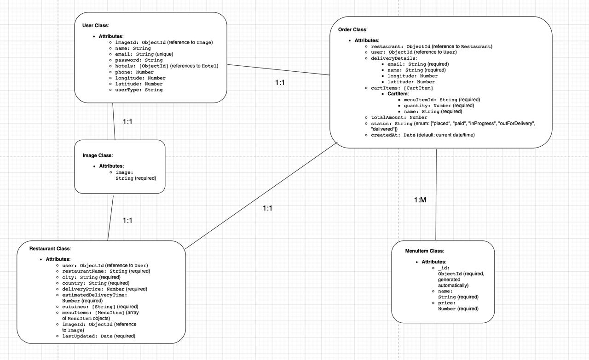

# Food Ordering Application

## Project Title
Food Ordering Application with MongoDB, Tailwindcss, React, and TypeScript

## Project Overview
The food ordering application aims to provide an intuitive and seamless platform for customers to browse through menus and order food. The system will allow users to select food items, customize orders, and make payments. It will integrate with a back-end database (MongoDB) to store orders, and menu data. React, coupled with TypeScript, will be used to develop a responsive and interactive front-end interface.

## Objectives
The main objectives of this project are:
- **Browse Menu & Select Food**: The app will allow users to browse through food categories, filter by the city of the restaurant’s locations, and select items for their orders.
- **Order Management**: Users can add multiple items to their cart, modify their orders, and proceed with checkout.
- **Data Preparation**: Create dummy data to populate the application and verify if the frontend functions properly with real data.

## Technology Stack

### Frontend
- **React**: The user interface will be built using React to offer an interactive and responsive experience.
- **TypeScript**: TypeScript will be used to ensure the application is type-safe, reducing bugs and enhancing code maintainability.
- **TailwindCSS**: For styling the front-end components and ensuring responsiveness across devices.

### Backend
- **MongoDB**: A NoSQL database will be used to store user data, food menus, orders, and payment records.
- **Node.js & Express**: The backend API will be built using Node.js and Express to handle data requests, and interaction with MongoDB.

## GitHub Repository
- **Repository Link**: [GitHub - Food Ordering App](https://github.com/cdrcstcs/CP3407-AdvancedSoftwareEngineer)

## Team Members
- **Student Name 1**: Phone Myint Naing  
  **Project Role(s)**: [e.g., Frontend Developer, Backend Developer, etc.]

- **Student Name 2**: Nguyen Dang Hieu  
  **Project Role(s)**: [e.g., Backend Developer, Database Administrator, etc.]

- **Student Name 3**: Low Yi Heng  
  **Project Role(s)**: [e.g., Frontend Developer, UI/UX Designer, etc.]

## Installation

### Prerequisites
Ensure you have the following installed on your machine:
- Node.js
- MongoDB (or access to a cloud MongoDB service)
- Git

### Steps to Run the Application Locally
1. Clone the repository:
   ```bash
   git clone https://github.com/cdrcstcs/CP3407-AdvancedSoftwareEngineer.git


# Food Ordering Application

## Project Title
Food Ordering Application with MongoDB, TailwindCSS, React, and TypeScript

## Activity One: User Interviews and Feedback

### Objective:
The goal of this activity was to gather feedback from potential users regarding their requirements and expectations for the food ordering application. Our team conducted interviews with three user groups:
- **Customers** (end-users who will order food)
- **Restaurant Owners** (who will list their menu items)

### Interview Questions & Responses

1. **What key features do you expect in a food ordering application?**
   - **Response**: "I expect a food ordering application to have a user-friendly interface, allowing easy navigation and smooth browsing. It should include restaurant and menu listings with clear categorization, secure multiple payment options, and real-time order tracking. Additionally, order management features, such as the ability to modify or cancel orders, customer reviews, and loyalty rewards, would enhance the overall experience."

2. **How important is customization of food orders?**
   - **Response**: "Customization of food orders is very important. Users should be able to modify their orders by removing or adding ingredients, selecting portion sizes, and choosing dietary preferences such as gluten-free, vegan, or halal options. This ensures that the app caters to a wide range of customer needs and preferences."

3. **What are your preferred payment methods?**
   - **Response**: "I prefer to have multiple payment options, including credit and debit cards (Visa, Mastercard), digital wallets such as PayPal, Apple Pay, and Google Pay, as well as cash on delivery and QR code payments. Having a variety of secure payment methods makes the ordering process more convenient and accessible."

4. **Would you like real-time order tracking?**
   - **Response**: "Yes, real-time order tracking is essential. It provides transparency by allowing users to track their order status from preparation to delivery. Push notifications at different stages, such as order acceptance, preparation, and out-for-delivery updates, would improve the overall user experience."

5. **What kind of filters would be useful for browsing menus?**
   - **Response**: "Useful filters for browsing menus would include cuisine type (Italian, Chinese, Indian, etc.), dietary preferences (vegetarian, halal, keto, etc.), price range, customer ratings, and estimated delivery time. These filters would help users quickly find the best food options based on their preferences."

6. **How would you like to receive order status updates?**
   - **Response**: "I would prefer to receive order status updates through push notifications for instant alerts. SMS updates would also be useful for those who may not have the app open. Additionally, email confirmations for receipts and records and in-app tracking for live updates would enhance the ordering experience."

## Next Steps:
Based on the feedback from the user interviews, we will incorporate the following features into the Food Ordering Application:
- A user-friendly interface with clear categories and easy navigation
- Customization options for food orders, including dietary preferences
- Multiple secure payment methods
- Real-time order tracking with push notifications and updates
- Filters for menu browsing based on preferences
- Order status updates via push notifications, SMS, and email

These features will help create an app that meets user expectations and enhances the overall user experience.

# User Feedback Summary

## Based on the interviews conducted, we gathered insights from two primary user groups: customers and restaurant owners. Below is a summary of their expectations and requirements.

## 1. Customer Feedback

### Key Features Expected:
- A simple and intuitive interface with easy navigation.
- A well-organized menu with food categories and filters.
- Secure multiple payment options (credit/debit cards, digital wallets, QR codes, cash on delivery).
- Real-time order tracking from preparation to delivery.
- Customer reviews and ratings for food and restaurants.
- Loyalty rewards and promotional discounts to encourage repeat orders.

### Importance of Customization:
High importance; users want options to:
- Modify ingredients (e.g., remove onions, add extra cheese).
- Choose portion sizes.
- Select dietary preferences (vegetarian, halal, gluten-free, keto, etc.).

### Preferred Payment Methods:
- Credit/Debit Cards (Visa, Mastercard).
- Digital Wallets (PayPal, Apple Pay, Google Pay).
- Cash on Delivery.
- QR Code Payments for faster transactions.

### Real-Time Order Tracking:
- Considered a must-have feature by most customers.
- Users want live tracking and push notifications at different order stages (accepted, prepared, out for delivery).

### Useful Filters for Browsing Menus:
- Cuisine type (Italian, Chinese, Indian, etc.).
- Dietary preferences (vegetarian, halal, keto, etc.).
- Price range to match their budget.
- Customer ratings to find the best restaurants.
- Estimated delivery time for faster service.

### Preferred Order Status Updates:
- Push notifications for real-time alerts.
- SMS updates for users who may not have the app open.
- Email confirmations for receipts and records.
- In-app tracking for detailed order status updates.

## 2. Restaurant Owner Feedback

### Key Features Expected:
- Easy menu management (add, edit, remove items with pricing and availability).
- Order management system to track incoming orders in real-time.
- Analytics and reporting to track sales, popular items, and customer preferences.
- Promotion and discount management to attract customers.
- Integration with delivery services for smooth fulfillment.

### Importance of Order Management:
- Critical for efficiency—restaurants need an intuitive dashboard to update order statuses quickly.
- Ability to mark preparing, ready, completed, or canceled for real-time customer updates.

### Preferred Payment Handling:
- Ability to receive direct payments through the platform (commission-based or subscription model).
- Option to set cash-only, card-only, or both payment methods for their restaurant.

### Business Growth Features:
- Insights on customer preferences to optimize menu offerings.
- Sales reports and trends to improve decision-making.
- Loyalty programs to retain repeat customers.

---

# Activity Two: Requirements Document and User Story Estimations

## User Story 1: Browsing and Ordering Food
**As a customer,**
_I want to browse a well-organized food menu, filter the food items by different criteria, and add my selected items to the cart,_
_So that I can easily find my desired food, customize my order, and proceed to checkout efficiently._

### Acceptance Criteria:
#### Menu Browsing:
- The app should display a list of food categories (e.g., starters, main course, desserts, etc.).
- Users should be able to browse food items within each category and view detailed information about each item (e.g., ingredients, portion size, price).

#### Filters:
Users can apply filters to search the menu by:
- Cuisine type (e.g., Italian, Chinese, Indian).
- Dietary preferences (e.g., vegetarian, gluten-free, halal).
- Price range (e.g., $10–$20).
- Location (city or restaurant location).
- Multiple filters can be applied at the same time.

#### Customizing Orders:
After selecting an item, the app should allow users to customize the order:
- Modify ingredients (e.g., remove onions, add extra cheese).
- Choose portion size (e.g., small, medium, large).
- Select dietary preferences (e.g., gluten-free, vegan).

#### Adding to Cart:
- Users can add multiple food items to the cart.
- Users can view the cart contents, modify quantities, or remove items from the cart before proceeding to checkout.

#### Checkout:
- Once satisfied, users can proceed to checkout, entering their delivery address and payment details.
- The app should offer multiple payment options, such as credit card, digital wallets (PayPal, Apple Pay, etc.), and cash on delivery.

## User Story 2: Real-Time Order Tracking for Customers
**As a customer,**
_I want to receive real-time order status updates via notifications,_
_So that I can track my order from preparation to delivery and be informed of any changes or delays._

### Acceptance Criteria:
#### Order Tracking:
- Once an order is placed, the customer should receive an initial notification confirming the order and estimated delivery time.
- Real-time updates should be sent when the order moves through various stages:
  - Order received.
  - Order is being prepared.
  - Order is ready for delivery.
  - Order is out for delivery.
  - Order successfully delivered.

#### Notifications:
- Push notifications should be sent to the customer at each stage, ensuring they are kept informed without opening the app.
- If the app is closed, SMS or email notifications should be sent.

#### Order Details:
- The customer can view detailed order status within the app, showing progress in real-time (e.g., "Preparing," "Out for delivery," etc.).
- Estimated delivery time should be updated as the order moves through each stage.

#### Order Modifications:
- If there are any delays or issues with the order, the app should send notifications with an updated estimated delivery time.
- The customer can request to modify or cancel the order if the restaurant permits it (e.g., via the app).

## User Story 3: Restaurant Order Management
**As a restaurant owner,**
_I want to manage incoming orders, update their status, and track order progress in real-time,_
_So that I can ensure smooth order fulfillment and keep customers informed of their order status._

### Acceptance Criteria:
#### Order Dashboard:
- Restaurant owners should have access to an intuitive dashboard where they can view all incoming orders.
- Each order should display essential details such as customer name, food items, order status, and delivery time.

#### Order Status Updates:
- Restaurant owners should be able to update the status of each order manually or automatically:
  - Order received.
  - Order being prepared.
  - Order ready for delivery.
  - Order completed.
- The app should allow owners to mark orders as canceled or completed if necessary.

#### Notifications for Order Status:
- Once an order status is updated, the customer should receive a notification reflecting the change (e.g., "Your order is being prepared").

#### Order Modification:
- If an order needs to be modified (e.g., due to ingredient unavailability or a customer request), the owner should be able to update the order and inform the customer.

#### Analytics and Reports:
- The app should provide restaurant owners with insights on order trends, popular menu items, customer feedback, and sales performance.
- These analytics should help owners optimize their menu offerings and improve business operations.


## Activity Three: User Story Prioritization and Iteration Planning

### 1. Prioritization of User Stories

#### Priority Criteria
- **High Priority**: Features essential for the core functionality of the application, directly impacting user experience and application flow.
- **Medium Priority**: Features that are important for usability but can be added once the core functionality is stable.
- **Low Priority**: Features that are nice to have but not critical for the initial version of the application.

#### User Stories and Their Prioritization

| **User Story**                           | **Priority** | **Reason**                                                                 |
|------------------------------------------|--------------|---------------------------------------------------------------------------|
| Browsing and Ordering Food              | High         | Fundamental for customers; the app cannot function without it.           |
| Real-Time Order Tracking for Customers   | High         | Essential for user satisfaction and transparency.                         |
| Restaurant Order Management              | High         | Necessary for restaurants to manage orders.                              |
| Order Customization and Cart Management | Medium       | Important for user satisfaction, but can be added after basic features.  |
| Payment Integration                      | Medium       | Critical for completing transactions, but can be tested with mock data.  |
| Loyalty Program and Promotions           | Low          | Good for retention, but not necessary for the first iteration.           |
| Advanced Search and Filtering            | Medium       | Useful but can be added after basic browsing features are implemented.   |
| Analytics and Reporting for Restaurants | Low          | Important for restaurant owners, but can be implemented after core features. |

### 2. Dividing User Stories into Iterations

Based on the prioritization, we will break the development of user stories into three iterations. Each iteration will focus on a set of features that build upon each other, ensuring a progressive release of functionalities.

#### **Iteration 1: Core Features for Browsing and Ordering**
**User Stories:**
- Browsing and Ordering Food
- Restaurant Order Management

**Description**:  
In this iteration, we will focus on getting the core functionalities of the application working. Customers will be able to browse menus, select food items, and add them to their cart. Restaurants will be able to view and manage orders in real-time.

**Estimated Time**: 3 weeks

**Tasks:**
- Build the front-end interface for browsing food categories and items.
- Implement the functionality for adding food items to the cart.
- Develop the backend API for order management and ensure real-time updates for restaurant owners.
- Perform basic testing to verify that browsing, ordering, and restaurant management are functional.

---

#### **Iteration 2: User Experience Enhancements and Order Tracking**
**User Stories:**
- Real-Time Order Tracking for Customers
- Order Customization and Cart Management

**Description**:  
In this iteration, we will enhance the user experience by allowing customers to track their orders in real time. We will also add functionality for customizing food orders and managing the cart (e.g., modifying order quantities, removing items).

**Estimated Time**: 2 weeks

**Tasks:**
- Implement the real-time order tracking feature, including notifications for order status.
- Allow users to customize their orders (e.g., remove ingredients, adjust portion size).
- Add features to modify the cart (add/remove items, change quantities).
- Conduct testing and integration to ensure smooth order tracking and customization.

---

#### **Iteration 3: Payment Integration, Analytics, and Additional Features**
**User Stories:**
- Payment Integration
- Advanced Search and Filtering
- Analytics and Reporting for Restaurants
- Loyalty Program and Promotions

**Description**:  
In this final iteration, we will integrate payment options and enhance the app's search capabilities. Restaurant owners will gain access to analytics and reporting features, and a loyalty program will be added to incentivize repeat customers.

**Estimated Time**: 3 weeks

**Tasks:**
- Integrate payment methods (credit/debit card, PayPal, QR code, etc.).
- Develop advanced filtering for searching food items (e.g., price range, dietary preferences).
- Implement an analytics dashboard for restaurant owners to view order data and trends.
- Add basic functionality for a loyalty program and promotional discounts.
- Perform extensive testing to ensure all features work seamlessly.

### 3. Iteration Summary

| **Iteration** | **Features**                                      | **Time Estimate** |
|---------------|---------------------------------------------------|-------------------|
| **Iteration 1** | Core functionalities for browsing, ordering, and order management | 3 weeks          |
| **Iteration 2** | Real-time order tracking, order customization, and cart management | 2 weeks          |
| **Iteration 3** | Payment integration, advanced search, analytics, and loyalty program | 3 weeks          |

### 4. Conclusion

By dividing the user stories into three iterations, we have created a structured plan that allows for the progressive development of the Food Ordering Application. Iteration 1 ensures that core features are functional, providing a foundation for future enhancements in Iteration 2. Finally, Iteration 3 will add advanced features like payment processing, search filters, and loyalty programs, rounding out the application for full deployment.

# Workshop 4
# Activity 1
# Food Ordering Application - User Stories and Estimations

## User Story 1: Browsing and Ordering Food
**As a customer, I want to browse a well-organized food menu, filter the food items by different criteria, and add my selected items to the cart, so that I can easily find my desired food, customize my order, and proceed to checkout efficiently.**

**Estimation: 40 hours**

### Tasks and Estimations:
- **Menu Browsing Interface (12 hours)**
  - Design UI for food categories and items: 4 hours
  - Implement front-end logic for menu browsing: 5 hours
  - Integrate with the back-end to fetch food items: 3 hours

- **Filters (10 hours)**
  - Design UI for filters (e.g., price, dietary restrictions, cuisine): 4 hours
  - Implement back-end logic for filtering food items: 3 hours
  - Test filtering functionality: 3 hours

- **Food Item Details (Customization, Prices) (10 hours)**
  - Design UI for food item details (ingredients, portion sizes, prices): 4 hours
  - Implement front-end logic for customizing food items: 4 hours
  - Integrate back-end API for updating food item customization: 2 hours

- **Cart Functionality and Checkout Process (8 hours)**
  - Implement functionality to add food items to the cart: 3 hours
  - Implement cart view and edit options (modify quantity, remove items): 3 hours
  - Design checkout page UI and integrate with back-end for order submission: 2 hours

---

## User Story 2: Real-Time Order Tracking for Customers
**As a customer, I want to receive real-time order status updates via notifications, so that I can track my order from preparation to delivery and be informed of any changes or delays.**

**Estimation: 30 hours**

### Tasks and Estimations:
- **Real-time Updates (15 hours)**
  - Design UI for displaying order status updates (preparing, ready, completed): 5 hours
  - Implement real-time order status updates (e.g., using WebSockets or polling): 6 hours
  - Test real-time updates across different devices: 4 hours

- **Push Notifications Integration (10 hours)**
  - Set up push notification service (Firebase/OneSignal): 4 hours
  - Implement push notifications for order status updates: 4 hours
  - Test notifications for different scenarios (order status changes, delays, etc.): 2 hours

- **SMS/Email Fallback (5 hours)**
  - Integrate SMS/Email notification service (Twilio, SendGrid): 3 hours
  - Implement logic for fallback SMS/Email notifications: 2 hours

---

## User Story 3: Restaurant Order Management
**As a restaurant owner, I want to manage incoming orders, update their status, and track order progress in real-time, so that I can ensure smooth order fulfillment and keep customers informed of their order status.**

**Estimation: 50 hours**

### Tasks and Estimations:
- **Order Dashboard (20 hours)**
  - Design UI for order management dashboard (incoming orders, current status): 8 hours
  - Implement backend API for fetching and displaying incoming orders: 6 hours
  - Implement front-end logic to display orders in real-time: 6 hours

- **Order Status Updates (Preparing, Ready, Completed) (15 hours)**
  - Design UI to update order statuses: 5 hours
  - Implement backend functionality to update order statuses (preparing, ready, completed): 6 hours
  - Integrate the order status with the real-time system: 4 hours

- **Menu Management (Edit/Add/Remove Items) (10 hours)**
  - Design UI for adding/editing/removing menu items: 4 hours
  - Implement backend logic to update menu items (CRUD operations): 5 hours
  - Test the menu management system: 1 hour

- **Analytics Integration (5 hours)**
  - Design UI for basic order analytics (total orders, revenue): 2 hours
  - Implement backend logic to fetch order data and generate reports: 2 hours
  - Integrate analytics data with the front-end: 1 hour

---

## Iteration Breakdown

### Iteration 1: Core Features for Browsing and Ordering (3 weeks)
- **Browsing and Ordering Food**
  - Tasks: Menu Browsing Interface (12 hours), Filters (10 hours), Food Item Details (Customization, Prices) (10 hours), Cart Functionality and Checkout Process (8 hours)
  - **Total time**: 40 hours

- **Restaurant Order Management**
  - Tasks: Order Dashboard (20 hours), Order Status Updates (15 hours)
  - **Total time**: 35 hours

---

### Iteration 2: User Experience Enhancements and Order Tracking (2 weeks)
- **Real-Time Order Tracking for Customers**
  - Tasks: Real-time Updates (15 hours), Push Notifications Integration (10 hours), SMS/Email Fallback (5 hours)
  - **Total time**: 30 hours

- **Order Customization and Cart Management**
  - Tasks: UI for Customization (5 hours), Backend for Customization (5 hours), Cart Management (5 hours)
  - **Total time**: 15 hours

---

### Iteration 3: Payment Integration, Analytics, and Additional Features (3 weeks)
- **Payment Integration**
  - Tasks: Integrate Payment Methods (15 hours)

- **Advanced Search and Filtering**
  - Tasks: Search Filters UI (5 hours), Backend for Advanced Filters (5 hours)

- **Analytics and Reporting for Restaurants**
  - Tasks: Analytics Dashboard UI (5 hours), Backend Analytics Integration (5 hours)

- **Loyalty Program and Promotions**
  - Tasks: Loyalty Program Logic (5 hours), Promo Code System (5 hours)

---

## Summary of Time Estimates by Iteration:
- **Iteration 1:**
  - **Total time**: 75 hours (3 weeks)

- **Iteration 2:**
  - **Total time**: 45 hours (2 weeks)

- **Iteration 3:**
  - **Total time**: 50 hours (3 weeks)

# Class Diagram

